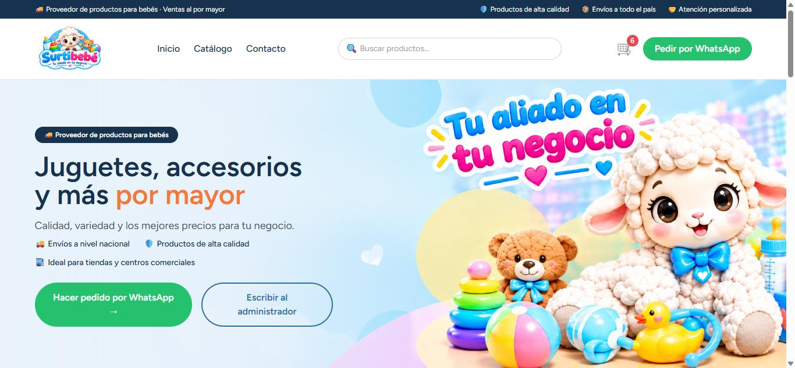
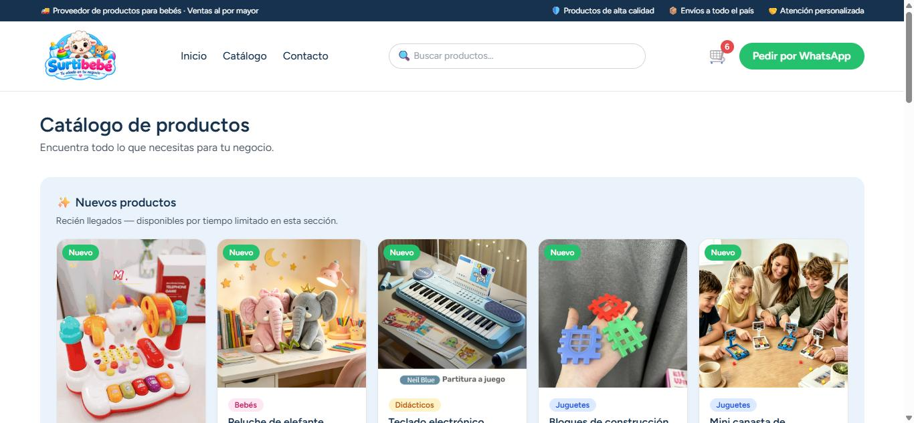
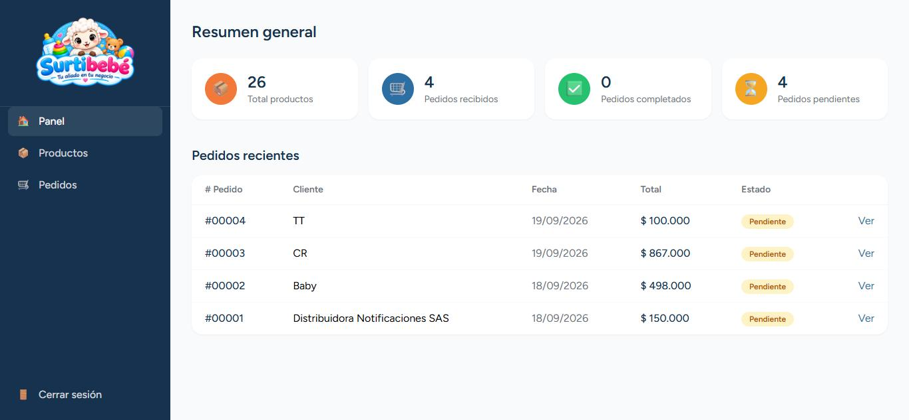

# Surtibebé

Tienda mayorista online para un proveedor de juguetes y productos para bebés. Los clientes arman su pedido en un catálogo público (sin necesidad de crear una cuenta) y lo confirman por WhatsApp o por formulario; el administrador gestiona productos, colores, stock e inventario desde un panel privado, y genera el PDF de cada pedido al vuelo.



## Stack

- **Backend:** Laravel 12, MySQL
- **Frontend:** React + Inertia.js, Tailwind CSS
- **PDF:** barryvdh/laravel-dompdf
- **Auth del panel admin:** Laravel Breeze

## Características

- **Catálogo público sin login**: búsqueda, filtros por categoría, orden por precio/nombre/recientes, sección de "nuevos productos".
- **Variantes de color por producto**, con **stock independiente por color** — el checkout y el panel de admin validan y descuentan el color exacto que se pidió, no un número compartido.
- **Carrito 100% del lado del cliente** (no requiere cuenta ni sesión) que viaja al servidor solo al confirmar el pedido.
- **Checkout con validación real** de compra mínima y stock disponible — nunca confía en lo que ya validó el navegador.
- **Notificación por correo al administrador** apenas entra un pedido nuevo (SMTP real, no solo log).
- **Panel de administración**: dashboard con métricas, CRUD de productos con imágenes y colores, gestión de pedidos con cambio de estado, y **edición de las líneas de un pedido** (cambiar color/cantidad o agregar otro producto) mientras siga pendiente — pensado para cuando dos pedidos compiten por el mismo color agotado.
- **PDF del pedido generado al vuelo** (no se guarda en el servidor, siempre refleja el estado real).
- **Descuento de stock solo al despachar** (no al confirmar el pedido, ya que no hay pago en línea) — con aviso claro en el panel si el stock ya no alcanza para marcar un pedido como enviado.
- Diseño responsive, pensado mobile-first, con iconos propios en vez de emojis.

## Capturas

| Catálogo público | Panel de administración |
|---|---|
|  |  |

## Cómo correrlo en local

```bash
composer install
npm install

cp .env.example .env
php artisan key:generate
# completar DB_* y MAIL_* en .env

php artisan migrate --seed
php artisan storage:link

npm run dev        # en una terminal
php artisan serve  # en otra
```

La app queda en `http://localhost:8000`. El seeder crea un usuario administrador con la contraseña de fábrica `password` (cámbiala antes de usarlo en producción).
